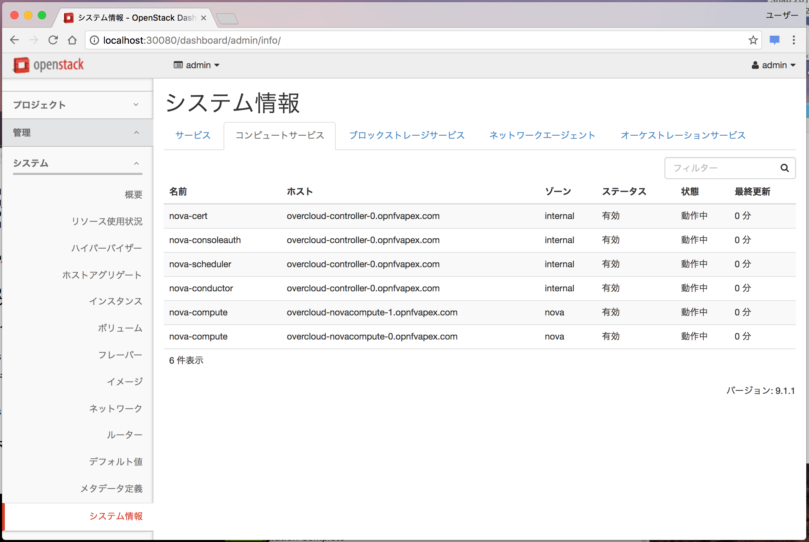

# OPNFV QuickStart

## 必須要件

* ssh-keygenでキーペアを作っておく。
* ホストにLinux KVMをインストールする。
* Linux KVMにdefaultというDHCP Enableなネットワークを作っておく。
* ホストのIPアドレスを固定する。

## 技術的な情報

* 「undercloud」はスクリプトで構築されます。
* 「undercloud」はdefaultネットワークに接続されます。
* 「overcloud」の各コンポーネントは自動生成されたネットワークに接続されます。
* 「undercloud」にSSHログインするには次のコマンドを実行します。

```
$ opnfv-util undercloud
```

* overcloudへログインするには、undercloudにログインしてovercloudrcのユーザー、パスワードでログインします。

* リモートのクライアントからOpenStack Dashboardにアクセスするには次のように実行してください。

```
% ssh <ユーザー>@<KVM HostのIPアドレス> -g -L <適当なポート>:<dashboardのIPアドレス>:80
```
実行例

```
% ssh root@172.16.214.10 -g -L 30080:10.0.3.10:80
```

コマンドを実行した端末のブラウザーで`http://localhost:30080/dashboard`でアクセス可能です。




## インストールの流れ

以下参照

* [OPNFV Apex (Release Colorado)を使ってCentOS7上にlibvirt/OpenStack (RDO版Mitaka)/OpenDaylightの環境を構築する](http://qiita.com/s1061123/items/3935114785f044741ccc)

私が使ったYAMLファイルをリポジトリーに置いておきます。